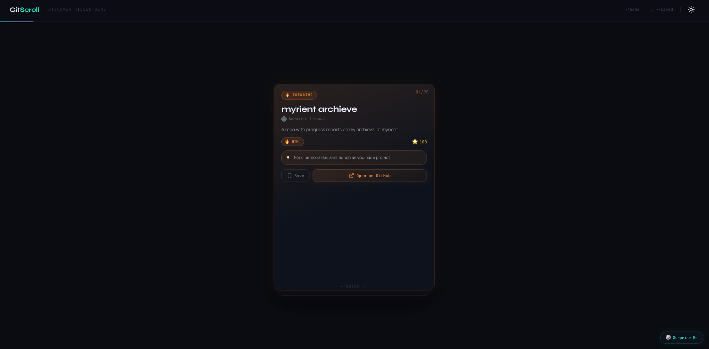

<p align="center">
  
</p>

<h1 align="center">GitScroll</h1>

<p align="center">
  Discover GitHub repos like TikTok. Scroll, swipe, save.
</p>

<p align="center">
  <a href="https://gitscroll-two.vercel.app"></a>
</p>

<p align="center">
  
  
  
  
  
</p>

---

## What is GitScroll?

GitScroll is a GitHub repository discovery platform with a TikTok-style vertical feed and Tinder-style swipe actions. Instead of searching for repos, you scroll through them — one card at a time.

**Scroll** through repos vertically · **Swipe right** to save · **Swipe left** to skip · **Tap** to flip for more details

---

## Features

- **Vertical feed** — Full-screen card-per-repo experience
- **Swipe to save** — Right to favorite, left to discard
- **Rotating discovery** — Randomly cycles through AI, CLI, developer tools, and general repos
- **Favorites** — Saved locally in your browser
- **Dark mode** — Easy on the eyes
- **Mock fallback** — Works without a GitHub token (uses curated mock data)

---

## Tech Stack

| Layer | Tech |
|---|---|
| Framework | Next.js 14 (App Router) |
| Language | TypeScript |
| Styling | Tailwind CSS |
| Animation | Framer Motion |
| Data Fetching | TanStack Query |
| API | GitHub Search API |
| Deployment | Vercel |

---

## Getting Started

```bash
git clone https://github.com/unaveenj/Gitscroll.git
cd Gitscroll
npm install
npm run dev
```

Open [http://localhost:3000](http://localhost:3000).

### GitHub Token (optional)

Without a token the app uses mock data. To get live repos:

```bash
# .env.local
GITHUB_TOKEN=your_github_personal_access_token
```

Generate one at [github.com/settings/tokens](https://github.com/settings/tokens) — no scopes needed for public repo search.

---

<p align="center">
  Made with ☕ by <a href="https://github.com/unaveenj">unaveenj</a>
</p>
